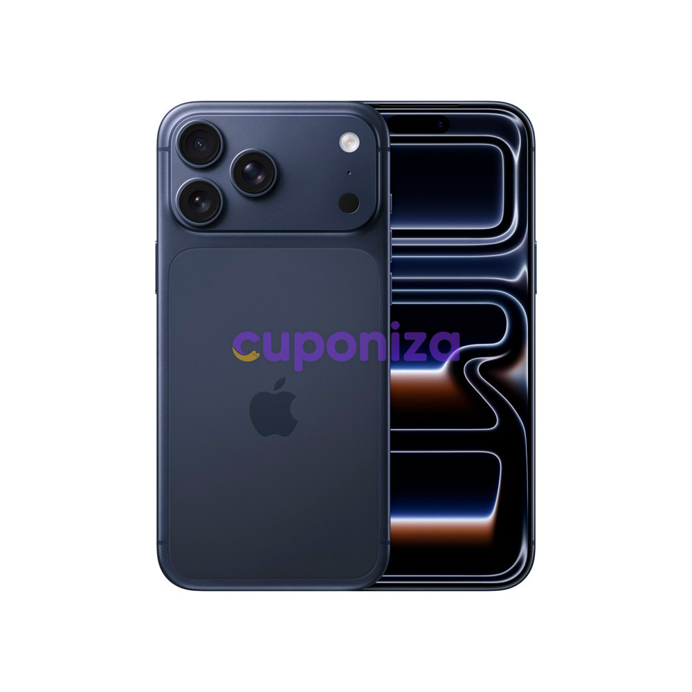

# 🚀 Watermark-API | etix


Uma API Node.js de alta performance para processamento de imagens e aplicação dinâmica de marcas d'água. Desenvolvida para a **etix** (e integrada ao ecossistema do **Cuponiza**), esta API permite sobrepor logos em imagens de produtos de forma proporcional e automatizada.

---

## ✨ Recursos Principais

* **Dynamic Overlay:** Sobreponha logos (marcas d'água) em qualquer imagem principal via URL.
* **Dimensionamento Inteligente:** O logo é automaticamente redimensionado para ocupar **20% da largura** da imagem principal, garantindo proporção visual em qualquer resolução.
* **Posicionamento Flexível:** Suporte para diferentes posições (centro, topo, base ou cantos) via parâmetros simples.
* **Processamento de Alta Performance:** Utiliza a biblioteca `sharp`, garantindo baixo consumo de memória e velocidade superior.
* **Pronto para Docker & Easypanel:** Já configurado com `Dockerfile` otimizado para deploy imediato em VPS (Contabo/Easypanel).

---

## 🛠️ Tecnologias Utilizadas

<p align="left">
  <a href="https://nodejs.org" target="_blank" rel="noreferrer"></a>
  <a href="https://fastify.io/" target="_blank" rel="noreferrer"></a>
  <a href="https://sharp.pixelplumbing.com/" target="_blank" rel="noreferrer"></a>
  <a href="https://www.docker.com/" target="_blank" rel="noreferrer"></a>
</p>

---

## ⚙️ Documentação da API

O endpoint principal é `GET /watermark`.

### Parâmetros (Query String)

| Parâmetro | Tipo     | Obrigatório | Descrição                                                                 | Padrão    |
| :-------- | :------- | :---------- | :------------------------------------------------------------------------ | :-------- |
| `main`    | `string` | **Sim** | URL da imagem principal (ex: foto do produto Magalu).                     | N/A       |
| `logo`    | `string` | **Sim** | URL da imagem do logo/marca d'água.                                       | N/A       |
| `pos`     | `string` | Não         | Posição do logo: `centro`, `cima`, `baixo` ou `canto`.                    | `centro`  |

---

## 💻 Rodando Localmente

Para testar e desenvolver em sua máquina local:

1. **Clone o repositório:**
   ```bash
   git clone https://github.com/rafaelrtavares/watermark-api.git
   cd watermark-api

2. **Instale as dependências:**
   ```bash
   npm install

3. **Inicie o servidor:**
   ```bash
   npm start

4. **Teste no navegador:**
   * A API estará rodando por padrão na porta 3028.
   * URL de Teste:
   ```bash
   http://localhost:3028/watermark?main=LINK_IMAGEM&logo=LINK_LOGO&pos=canto

---

## 🧑‍💻 Desenvolvido por

**Rafael Rodrigues Tavares**
* **LinkedIn:** [linkedin.com/in/tavaresrafael](https://www.linkedin.com/in/tavaresrafael/)
* **GitHub:** [@rafaelrtavares](https://github.com/rafaelrtavares)

---

## 📄 Licença

Este projeto está sob a licença MIT.
